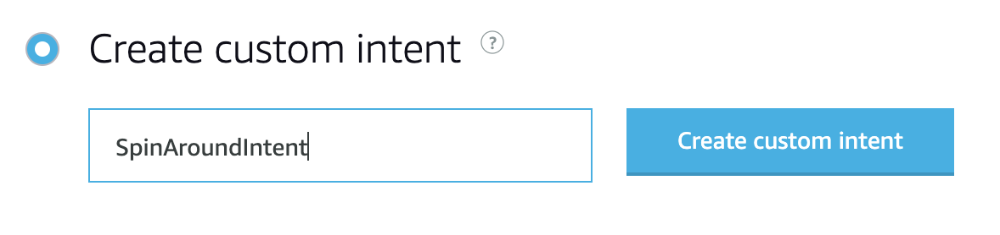

# Create an ASK skill

At this point, you've seen how to send a JSON-based message via MQTT and the AWS IoT dashboard. Now, we'll use voice to do the same.

In this section, you'll create a skill that will 1) receive voice input from an Alexa-enabled device, 2) use the [certificates you created](../aws-iot/README.md) to secure a message, and 3) send the message to the robot.

## Create an Alexa-hosted skill

An Alexa-hosted skill gives you a set of cloud services tuned to your skill-building needs and a skill package that leverages the latest Alexa Skills Kit (ASK) and AWS SDKs. Hosted skills allow for rapid iteration and makes Alexa-hosted skills the easiest way to get started with a new custom skill.

First, sign in to the Alexa Developer Console at [https://developer.amazon.com/alexa/console/ask](https://developer.amazon.com/alexa/console/ask).

### TIP
If you have an Echo device, sign in with the same email address with which the device is registered.

Next, click the **Create Skill** button and give your skill a name, "Workshop Robot". Keep the language at "English (US)", and under "Choose a model to add to your skill," choose "Custom." Then, under "Choose a method to host your skill's backend resources," choose "Alexa-Hosted (Python)".

Finally, scroll back to the top and click the **Create skill** button to begin the creation of your skill. It may take a minute for resources to be provisioned. 

## Update your Interaction Model

You should now see the Alexa Developer Console for your _Workshop Robot_ skill. 

Your skill comes with several built-it "intents." An intent represents an action that fulfills a user's spoken request. Intents can optionally have arguments called slots. You can see there are some built-in intents like _AMAZON.CancelIntent_, which let a user cancel their request, or _AMAZON.StopIntent_, which allow a user to stop their interaction. Let's add two more.

## Intents

We'll creating one intent to make the robot to spin around in a circle, and one intent to make the robot spin move in a certain direction.

### SpinAroundIntent

Click the **+ Add** button next to "Intents" to add a new intent. 

With "Create custom intent" selected, give your intent the name __SpinAroundIntent__, then click the **Create custom intent** button. 

Think about what a user might say to make the robot move, like "spin" or "spin around". Add both "spin" and "spin around" as sample utterances.

After you type each sample utterance, press your return key or click the small **"+"** (plus) button to add it. Click the **Save Model** button at the top of the screen after you've added the sample utterances.

### MoveIntent

Click the **+ Add** button next to "Intents" to add another new intent. 

With "Create custom intent" selected, give your intent the name __MoveIntent__, then click the **Create custom intent** button.

Think about what a user might say to make the robot move, like "move forward" or "move backwards" or "go forwards."

We'll add those in just a moment. But, instead of making multiple intents for different directions, we can make a single intent with a _slot_, which will act as a variable.

### Slot Types

Before we can finalize our intent, we should make a custom slot type. On the left navigation menu under "Intents," scroll down to "Slot Types" and click the **+ Add** button.

Give your slot type a name, `direction`, then click the **Create custom slot type** button.

### Slot Values

Now we need to add what terms we're looking for when we use the `direction` slot type. Under "Slot Values", add the directions `forward` and `spin`. Click the **Save Model** button after you've added the slot values.

### Intent Slots

Go back and click on your `MoveIntent` in the left navigation menu. Scroll down to "Intent Slots" and add a new slot, called "direction", then click the small **"+"** (plus) button. Under this "Slot Type" dropdown, select `direction`.

### Sample Utterances

Scroll back up to "Sample Utterances." In the box for "What might a user say to invoke this intent?", add the following samples, using `{direction}` as a variable:

    move {direction}
    go {direction}
    head {direction}

After you type each sample utterance, press your return key or click the small **"+"** (plus) button to add it. Click the **Save Model** button after you've added the sample utterances.

### HelloWorldIntent

You won't need this intent for this workshop. Click the trash can icon next to `HelloWorldIntent` to delete it. Save the model.

## Build the model

You've just created a custom slot with values, and two intents that will listen for instructions on which direction to move your robot. Now click the **Build Model** button (near the top of the page) to kick off a background process that will train the model that will listen for the intents in your skill.

### WAIT
Wait until you see a message that shows "Quick Build Successful" before continuing to the next step. It might take up to a minute.

When the build is successful, it's time to [add certificates to your skill](../ask/certificates.md).
