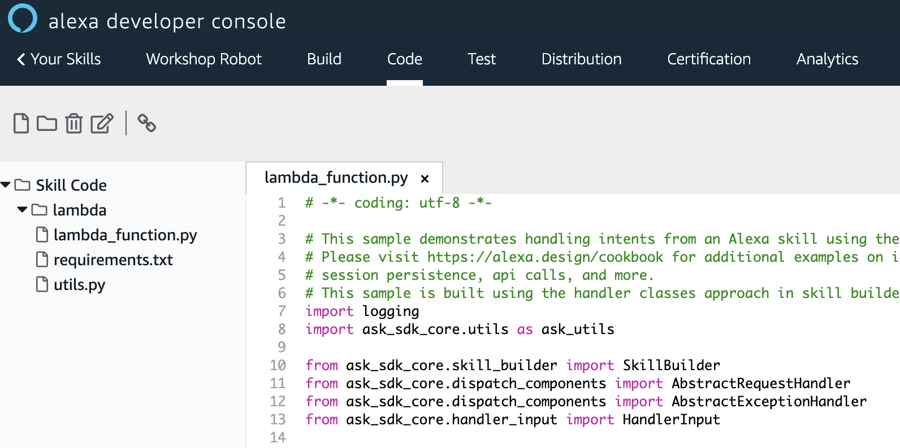
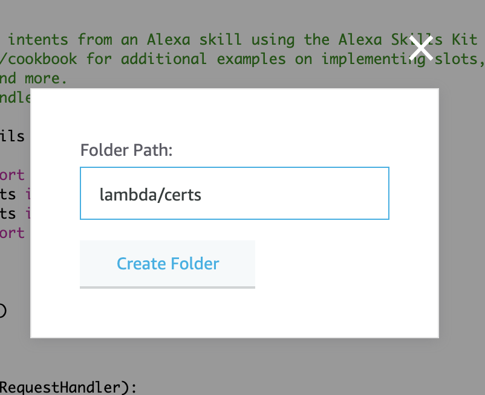
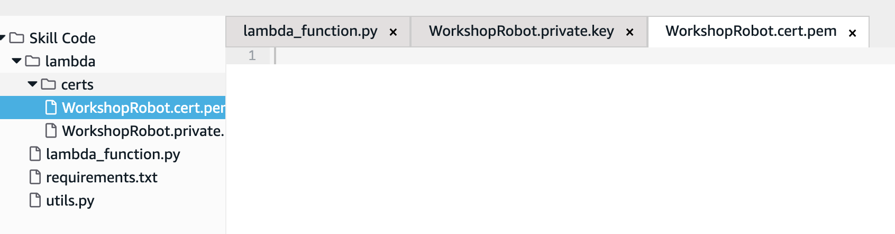
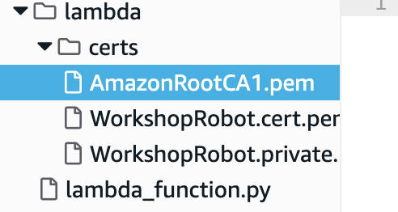

# Add certificates to your skill

While still in the developer console for your skill, click the “Code” tab at the top of the page. This will open an IDE with a pre-built template. 

## Create a `certs` folder

Before we get into the code, we'll need to add the certificate and private key file we created in earlier in the workshop. These files will authenticate our message to our specific robot. First, right-click in the "Skill Code" pane on the left side of the screen and select "Create Folder." Name this folder "lambda/certs", then click the **Create Folder** button.

Let's create two blank files in this folder.

## Create files for the certificate and private key

### WARNING: Drag and drop
Unfortunately, the drag-and-drop technique you used in AWS RoboMaker doesn't quite work here yet. You'll have to manually create these files by following the instructions below.

Right-click on the "certs" folder and choose "Create File". In the dialog that opens, type "WorkshopRobot.cert.pem", so that the file path reads "/lambda/certs/WorkshopRobot.cert.pem", then click the **Create File** button. Repeat this same process for "/lambda/certs/WorkshopRobot.private.key", 

## Add content to each file

Now we'll add the content from each of the two respective files you downloaded from the AWS IoT service. Locate the .zip file you downloaded and open it with a text editor like Notepad or TextEdit. Copy the contents of each of those files into their respective files you just created.

### TIP: Mac OS X
Right-click on the file in your download folder, click on "Open With," then "Other," then find "TextEdit.app" in the list of programs.

### TIP: Windows
Right-click on the file in your download folder, select "Open With," then "Choose Another App", then find "Notepad".

For each file you update, don't forget to click the **Save** button just above the editor window.

## Add the Amazon Root CA file

We'll need one more certificate before we can continue. In the same `certs` folder, create a new file, and call it "AmazonRootCA1.pem". Take care to get the capitalization correct.

Add the content below to this file (/lambda/certs/AmazonRootCA1.pem), then save the file using the **Save** button.

    -----BEGIN CERTIFICATE-----
    MIIDQTCCAimgAwIBAgITBmyfz5m/jAo54vB4ikPmljZbyjANBgkqhkiG9w0BAQsF
    ADA5MQswCQYDVQQGEwJVUzEPMA0GA1UEChMGQW1hem9uMRkwFwYDVQQDExBBbWF6
    b24gUm9vdCBDQSAxMB4XDTE1MDUyNjAwMDAwMFoXDTM4MDExNzAwMDAwMFowOTEL
    MAkGA1UEBhMCVVMxDzANBgNVBAoTBkFtYXpvbjEZMBcGA1UEAxMQQW1hem9uIFJv
    b3QgQ0EgMTCCASIwDQYJKoZIhvcNAQEBBQADggEPADCCAQoCggEBALJ4gHHKeNXj
    ca9HgFB0fW7Y14h29Jlo91ghYPl0hAEvrAIthtOgQ3pOsqTQNroBvo3bSMgHFzZM
    9O6II8c+6zf1tRn4SWiw3te5djgdYZ6k/oI2peVKVuRF4fn9tBb6dNqcmzU5L/qw
    IFAGbHrQgLKm+a/sRxmPUDgH3KKHOVj4utWp+UhnMJbulHheb4mjUcAwhmahRWa6
    VOujw5H5SNz/0egwLX0tdHA114gk957EWW67c4cX8jJGKLhD+rcdqsq08p8kDi1L
    93FcXmn/6pUCyziKrlA4b9v7LWIbxcceVOF34GfID5yHI9Y/QCB/IIDEgEw+OyQm
    jgSubJrIqg0CAwEAAaNCMEAwDwYDVR0TAQH/BAUwAwEB/zAOBgNVHQ8BAf8EBAMC
    AYYwHQYDVR0OBBYEFIQYzIU07LwMlJQuCFmcx7IQTgoIMA0GCSqGSIb3DQEBCwUA
    A4IBAQCY8jdaQZChGsV2USggNiMOruYou6r4lK5IpDB/G/wkjUu0yKGX9rbxenDI
    U5PMCCjjmCXPI6T53iHTfIUJrU6adTrCC2qJeHZERxhlbI1Bjjt/msv0tadQ1wUs
    N+gDS63pYaACbvXy8MWy7Vu33PqUXHeeE6V/Uq2V8viTO96LXFvKWlJbYK8U90vv
    o/ufQJVtMVT8QtPHRh8jrdkPSHCa2XV4cdFyQzR1bldZwgJcJmApzyMZFo6IQ6XU
    5MsI+yMRQ+hDKXJioaldXgjUkK642M4UwtBV8ob2xJNDd2ZhwLnoQdeXeGADbkpy
    rqXRfboQnoZsG4q5WTP468SQvvG5
    -----END CERTIFICATE-----

### NOTE
Take care to make sure that there are no extra spaces at the beginning of the lines when you copy and paste.

You should now have three files in your certs folder. Now that you've added the certificates necessary to secure communications with your robot, you're ready to [add the code to send messages!](code.md)

