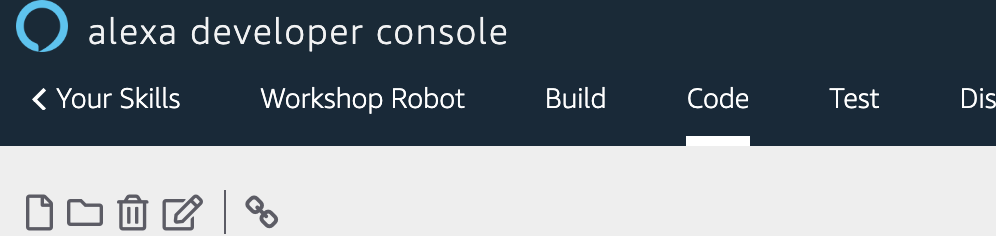
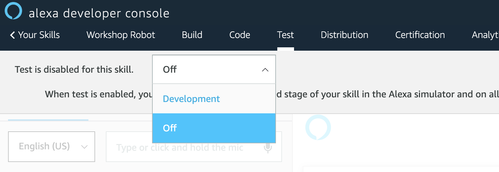
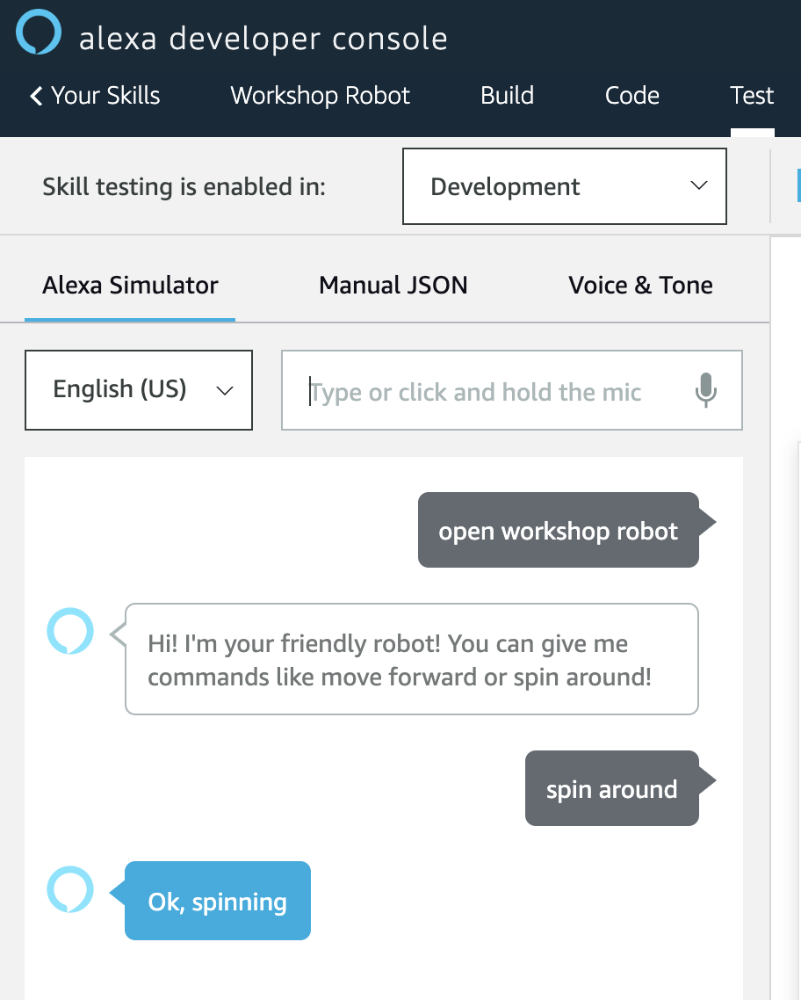
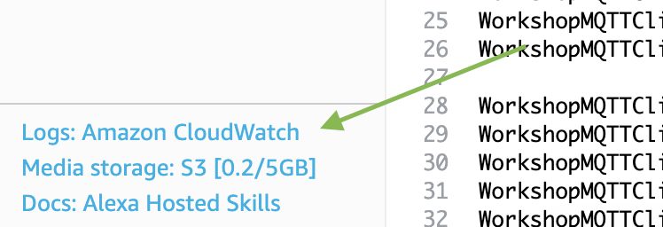
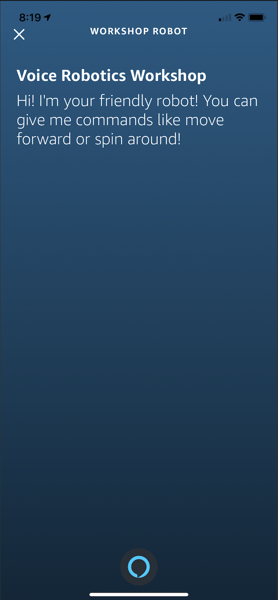

# Add code to your skill

While still in the developer console for your skill, click the "Code" link. 



## requirements.txt

The `requirements.txt` file (in your left file navigator) contains the dependencies your function will need. We'll need to add an additional dependency now. Double-click "requirements.txt" to open it and add `AWSIoTPythonSDK==1.4.7`. Your requirements.txt file should contain the following:

    boto3==1.9.216
    ask-sdk-core==1.11.0
    AWSIoTPythonSDK==1.4.7

(If your versions don't quite match, it's okay--the Alexa Skills Kit frequently updates dependencies.)

Click the **Save** button, then open "lambda_function.py".

## lambda_function.py

Open the file `lambda_function.py`. Replace the existing code with the code below. 

### NOTE: Replace `AWS_IOT_ENDPOINT` VALUE
Replace the default value of `AWS_IOT_ENDPOINT` on line 22 with the value you retrieved previously, from your [AWS IoT settings](https://us-west-2.console.aws.amazon.com/iot/home?region=us-west-2#/settings) dashboard.

``` python
# -*- coding: utf-8 -*-
import random
import logging
import os
import time
import json
import boto3

from ask_sdk_core.utils import is_intent_name, is_request_type, viewport
from ask_sdk_model.ui import SimpleCard
from ask_sdk_core.skill_builder import SkillBuilder

from AWSIoTPythonSDK.MQTTLib import AWSIoTMQTTClient

from boto3.dynamodb.conditions import Key, Attr
from botocore.exceptions import ClientError

from ask_sdk_model.interfaces.alexa.presentation.apl import (
    RenderDocumentDirective, ExecuteCommandsDirective, SpeakItemCommand,
    AutoPageCommand, HighlightMode)

AWS_IOT_ENDPOINT = "a2000000000000-ats.iot.us-west-2.amazonaws.com"

WorkshopMQTTClient = AWSIoTMQTTClient("VoiceRoboticsWorkshop-ASK")
WorkshopMQTTClient.configureEndpoint(AWS_IOT_ENDPOINT, 8883)
WorkshopMQTTClient.configureCredentials('./certs/AmazonRootCA1.pem','./certs/WorkshopRobot.private.key', './certs/WorkshopRobot.cert.pem')

WorkshopMQTTClient.configureAutoReconnectBackoffTime(1, 32, 20)
WorkshopMQTTClient.configureOfflinePublishQueueing(-1)  # Infinite offline Publish queueing
WorkshopMQTTClient.configureDrainingFrequency(2)  # Draining: 2 Hz
WorkshopMQTTClient.configureConnectDisconnectTimeout(10)  # 10 sec
WorkshopMQTTClient.configureMQTTOperationTimeout(5)  # 5 sec

WorkshopMQTTClient.connect()

SKILL_NAME = "Voice Robotics Workshop"
HELP_MESSAGE = "You can tell the robot to move a direction, like move forward, or to spin around."
HELP_REPROMPT = "What can I help you with?"
STOP_MESSAGE = "Goodbye for now!"
FALLBACK_MESSAGE = "Oops! This robot isn't smart enough, yet. Say something like move forward."
FALLBACK_REPROMPT = 'What can I help you with?'
EXCEPTION_MESSAGE = "Sorry. This robot cannot comply."

sb = SkillBuilder()
logger = logging.getLogger(__name__)
logger.setLevel(logging.DEBUG)

def format_mqtt_message(directive):
    payload = {}
    payload['data'] = directive
    
    return json.dumps(payload)

def send_mqtt_directive(topic, directive):
    payload = format_mqtt_message(directive)
    WorkshopMQTTClient.publish(topic, payload, 1)

@sb.request_handler(can_handle_func = is_intent_name("SpinAroundIntent"))
def spin_around_intent_handler(handler_input):
    speech = "Ok, spinning"
    send_mqtt_directive("voice_command", "spin")

    handler_input.response_builder.speak(speech).set_card(SimpleCard(SKILL_NAME, speech)).set_should_end_session(False)
    return handler_input.response_builder.response

@sb.request_handler(can_handle_func = is_intent_name("MoveIntent"))
def move_intent_handler(handler_input):
    # Parse direction from event
    direction_value = handler_input.request_envelope.request.intent.slots['direction'].value
    
    if direction_value.find('forw') == 0: # Finds "forward", "forwards", etc
        direction = "forward"
        speech = "Ok, moving forward"
        send_mqtt_directive("voice_command", direction)
    # elif direction_value.find('backw') == 0: # Finds "backward", "backwards", etc # Example code to add `backwards`
        # direction = "backward"
        # speech = "Ok, moving backward"
        # send_mqtt_directive("voice_command", direction)
    else:
        direction = False
        speech = "Hmm. Please ask me to move only forward or to spin."

    handler_input.response_builder.speak(speech).set_card(SimpleCard(SKILL_NAME, speech)).set_should_end_session(False)
    return handler_input.response_builder.response

@sb.request_handler(can_handle_func=is_request_type("LaunchRequest"))
def launch_request_handler(handler_input):
    speech = "Hi! I'm your friendly robot! You can give me commands like move forward or spin around!"
    
    handler_input.response_builder.speak(speech).set_card(SimpleCard(SKILL_NAME, speech)).set_should_end_session(False)
    return handler_input.response_builder.response

@sb.request_handler(can_handle_func = is_intent_name("AMAZON.HelpIntent"))
def help_intent_hanlder(handler_input):
    return handler_input.response_builder.speak(HELP_MESSAGE).ask(HELP_REPROMPT).set_card(SimpleCard(SKILL_NAME, HELP_MESSAGE)).response

@sb.request_handler(can_handle_func = is_intent_name("AMAZON.CancelIntent"))
def cancel_intent_handler(handler_input):
    return handler_input.response_builder.set_should_end_session(True).response

@sb.request_handler(can_handle_func = is_intent_name("AMAZON.StopIntent"))
def stop_intent_handler(handler_input):
    return handler_input.response_builder.set_should_end_session(True).response

@sb.request_handler(can_handle_func = is_intent_name("AMAZON.FallbackIntent"))
def fallback_intent_handler(handler_input):
    return handler_input.response_builder.speak(FALLBACK_MESSAGE).ask(FALLBACK_REPROMPT).set_card(SimpleCard(SKILL_NAME, FALLBACK_MESSAGE)).response

@sb.request_handler(can_handle_func=is_request_type("SessionEndedRequest"))
def session_ended_request_handler(handler_input):
    """Handler for Session End."""
    # type: (HandlerInput) -> Response
    logger.info("In SessionEndedRequestHandler")
    return handler_input.response_builder.set_should_end_session(True).response

@sb.exception_handler(can_handle_func=lambda i, e: True)
def all_exception_handler(handler_input, exception):
    """Catch all exception handler, log exception and
    respond with custom message.
    """
    # type: (HandlerInput, Exception) -> Response
    logger.error(exception, exc_info=True)

    handler_input.response_builder.speak(EXCEPTION_MESSAGE).ask(EXCEPTION_MESSAGE)

    return handler_input.response_builder.response

@sb.global_request_interceptor()
def request_logger(handler_input):
    print("Request received: {}".format(handler_input.request_envelope.request))

lambda_handler = sb.lambda_handler()
```

Click the **Save** button, then the **Deploy** button and wait for confirmation. When complete, it's time to test!

## Test via voice simulator

While still in the Alexa Developer Console, click the "Test" tab. Enable testing for the skill by clicking the dropdown next to "Test is disabled for this skill," and select "Development":



In the voice input box, type (or hold the microphone to speak) the following to open up your skill:

> open workshop robot

Then, send a `spin` directive to your robot:

> spin around



Switch back to your simulation window -- you should now see your robot spinning around! 

## Troubleshooting 

If you run into issues testing your skill, Amazon CloudWatch is a great place to start. Click the "Code" tab near the top of your window, then look for "Logs: Amazon CloudWatch" in the lower left side of your screen.



## Test via the Alexa mobile app (or device)

If you have the Alexa mobile app on your phone, you can do the same. Open the Alexa app, press the Alexa icon to enable voice mode, and try "tell workshop robot to spin around", or "open workshop robot", then "move forward".



## Wrap

Congratulations! In this workshop you've built a robot, launched it into a virtual world, and sent commands with your voice to make it take action! You've learned the foundation that roboticists use in the real world, and can build on top of what you've learned today.

If you're eager to do more, see some ideas in [Extra Credit](../extra-credit/README.md)!


