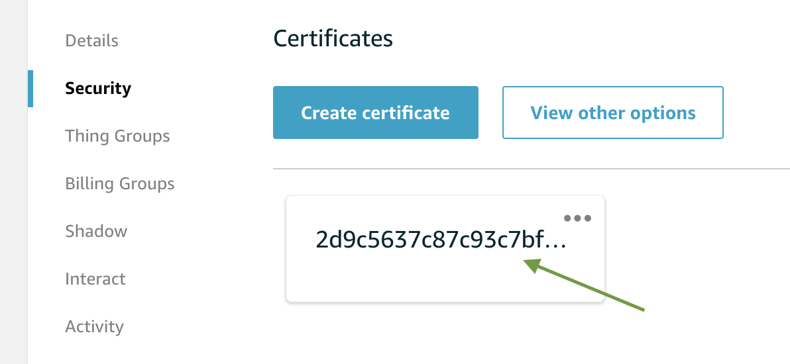
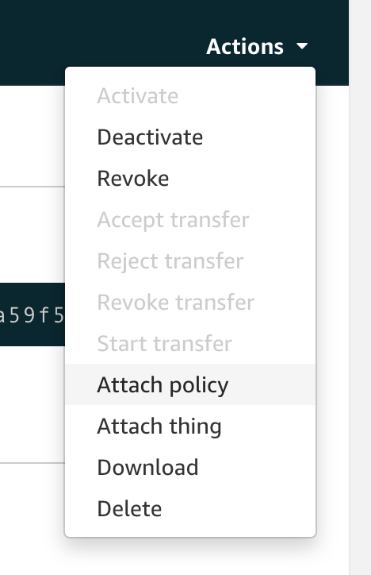

# Secure communication with AWS IoT

In this section you'll learn about the MQTT and how to use it to securely pass messages to your robot.

## MQTT 

MQTT is a widely adopted, lightweight messaging protocol designed for constrained devices. A common way to communicate with robotics remotely is to send messages to robots via MQTT messages. The system you build today will use X.509 Certificates to authenticate the robot with AWS IoT Core, allowing you to pass messages securely.

## Create certificates

Visit the [AWS IoT console](https://us-west-2.console.aws.amazon.com/iot/home?region=us-west-2). If this is your first time visiting the AWS IoT console, you may need to click the **Get started** button to get to the main dashboard.

When the IoT console loads, look to the left navigation panel, click "Onboard", then click the **Get started** button to start the connection wizard.

1. Click **Get started** to move past the overview screen

2. Choose "Linux/OSX" as your platform and "Python" as the AWS IoT Device SDK, then click **Next step**.

3. In the "Register a thing" step, give your "thing" (a robot, in this case) a name, "WorkshopRobot", then click **Next step**.

4. Click the "Download connection kit for Linux/OSX" button. This downloads a `connect_device_package.zip` file containing the certificate and private key you'll need. When the file has downloaded, click **Next step**.

5. You do not need to follow the steps on the "Configure and test your device" section. Click **Done**, and then **Done** again to take you to your "Things" hub.

## Attach a new policy to your certificate

1. Select your "WorkshopRobot" from the [Thing hub](https://us-west-2.console.aws.amazon.com/iot/home?region=us-west-2#/thinghub) 

2. Choose "Security" from the left navigation menu. 

3. We need to work with your certificate. Click the box containing your certificate's identification:

4. Certificate details will load. Click on the "Actions" dropdown in the upper right, then "Attach Policy."

5. Choose the "VoiceRoboticsWorkshopPolicy", which was created by the CloudFormation bootstrapping.

## Get your AWS IoT endpoint

To communicate with AWS IoT, devices must connect to an endpoint in your account. Let's grab that now. 

1. Go back to your [Thing hub](https://us-west-2.console.aws.amazon.com/iot/home?region=us-west-2#/thinghub). 
2. Near the bottom of the left navigation menu, find and click the ["Settings" link](https://us-west-2.console.aws.amazon.com/iot/home?region=us-west-2#/settings). 
3. Copy the value of **Custom endpoint** and save it somewhere. You'll need it in the next step.

When you've attached the policy and copied your custom endpoint, you're ready to for the next step, where you'll [setup your robot](../aws-robomaker/README.md).

