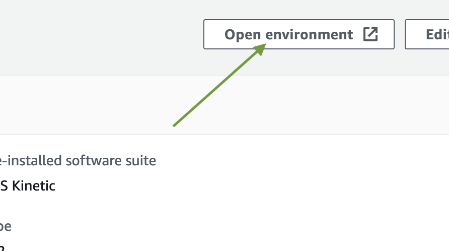
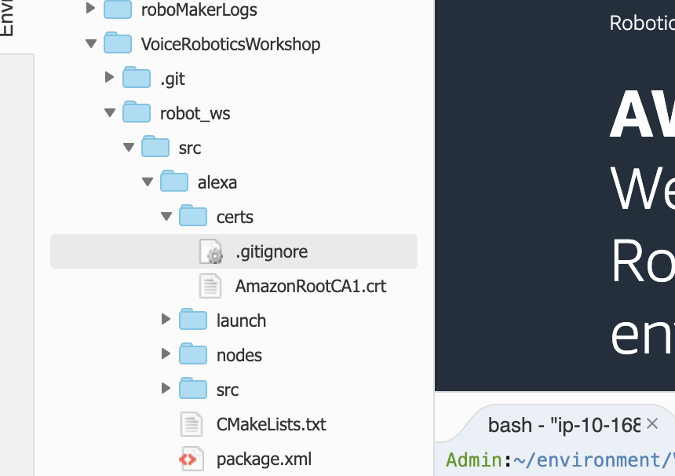
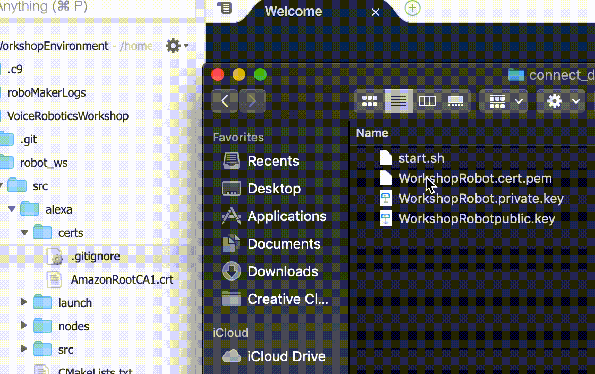
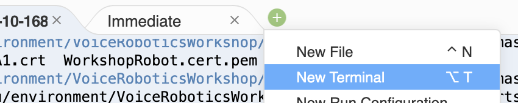
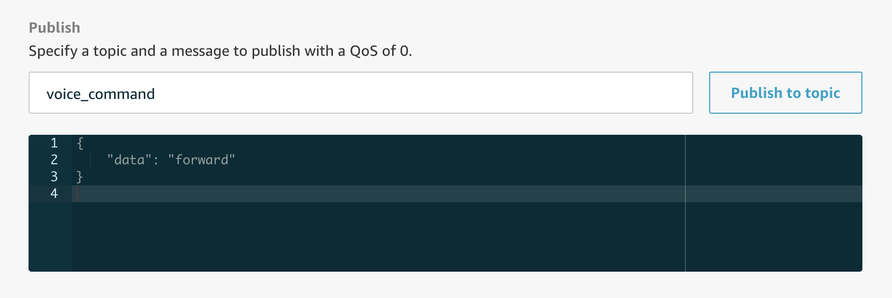

# Setting up your robot

## Open your RoboMaker environment

By now, your RoboMaker development environment should have had time to be provisioned. Visit the "Development Environments" [dashboard in AWS RoboMaker](https://us-west-2.console.aws.amazon.com/robomaker/home?region=us-west-2#ides). Click on your "WorkshopEnvironment" environment link, then click the **Open environment** button to open the environment. 



When opened, you'll see a cloud-based IDE that will allow you to edit code and use a terminal to interact with your virtual machine. In the bottom pane, you'll see a terminal is opened for you already. If you need more space, you can click and drag the divider that separates the terminal from the IDE. 

## Clone the robot code

In the terminal of your AWS RoboMaker environment, use the following to clone the code you will need to interact with your robot in a virtual world:

``` bash
cd ~/environment
git clone https://github.com/alexa-labs/voice-robotics-workshop VoiceRoboticsWorkshop
```

### Setup dependencies

In the terminal of your AWS RoboMaker environment, run a setup file to install dependencies:

``` bash
cd ~/environment/VoiceRoboticsWorkshop/
bash setup.sh
```

This setup process will take some time. While the script downloads dependencies and creates a simulation package, you can continue on to the next step.

## Add the AWS IoT certificate and private key

To give the robot the ability to communicate securely with your system, we need to add the certificate and private key you downloaded in the previous step. In the left navigation menu, expand the `VoiceRoboticsWorkshop` folder, then the `robot_ws` folder, the `src` folder, the `alexa` folder, and finally the `certs` folder:



Open the `connect_device_package.zip` file you downloaded in the previous step. Two of the files in this package will need to be added to your `certs` folder. If your browser and OS support drag-and-drop, you should be able to take `WorkshopRobot.cert.pem` and `WorkshopRobot.private.key` and drag them to the certs folder. 



### TIP 
If you're not able to drag-and-drop the files, right-click on the `certs` folder, and select "New File." Name the file _WorkshopRobot.cert.pem_, then add the contents of your downloaded file to this new file. Repeat the process for _WorkshopRobot.private.key_.

If your file navigator disappears, click the "Environment" tab to bring it back (or hide it).

Now that your certificates have been added to the robot, let's test communications.

## Test communication (Optional)

### TIP: Running short on time?
The next 3 steps in this section may take up to 10 minutes. If you're running short on time, it's okay to skip this section, and you can jump down to [Build, bundle, and upload your application](#build-bundle-and-upload-your-application). If you have problems later though, this section is a good place to debug issues.

### Step 1: Set your `ENDPOINT` and `CERTS_LOCATION` environment variable

For your robot to send/receive messages, it will need to know the endpoint to which it connects, and where the certificates it will use to authenticate itself. You've already copied the endpoint value from [the settings page of your IoT dashboard](https://us-west-2.console.aws.amazon.com/iot/home?region=us-west-2#/settings).

If your setup script is still running, open a new terminal in your RoboMaker environment. Click the small "plus" button, then "New Terminal" to open a new terminal tab.



Then, set these variables (don't forget to replace the endpoint):

``` bash
export ENDPOINT=<your-AWS-IoT-endpoint-here> 
export CERTS_LOCATION=/home/ubuntu/environment/VoiceRoboticsWorkshop/robot_ws/src/alexa/certs/
```

### TIP
Your endpoint variable should look something like `a2000000000000-ats.iot.us-west-2.amazonaws.com`. Make sure both variable names are CAPITALIZED.

### Step 2: Start the listener

Your robot code needs to register with a ROS master node in order to communicate with the outside world. Let's start the server:

1) Open a new terminal tab
2) Run `roscore` to launch the ROS master:

``` bash
roscore
```

Back in your previous terminal tab, follow the commands below to navigate to your robot code and run the listener:

``` bash
cd ~/environment/VoiceRoboticsWorkshop/robot_ws/src/alexa/nodes
python listener.py

[INFO] [1574087854.956432]: Alexa node started loading
[INFO] [1574087854.958822]: Alexa node created publisher on /cmd_vel
[INFO] [1574087854.959296]: Alexa node attempting subscribing to voice_command with client VoiceRoboticsWorkshop-ClFrIXzj3txC
[INFO] [1574087857.325006]: Alexa node ready and listening on the `voice_command` topic
```

If you see the output "Alexa node ready and listening on voice_command", you're ready to test communications. If you see an exception, like `AWSIoTPythonSDK.exception.AWSIoTExceptions.subscribeTimeoutException`, it's likely your certificates were not properly added to the `certs` folder. Check the spelling and contents of each file you added and try again.

### Step 3: Send a message through AWS IoT

Finally, let's send a message to the `voice_command` topic. Back in your [AWS IoT console](https://us-west-2.console.aws.amazon.com/iot/home?region=us-west-2#/test), click "Test" from the left navigation menu. Scroll to the bottom of the right pane to the **Publish** section. Specify the topic as `voice_command`, and change the payload to the following:

``` json
{
    "data": "forward"
}
```



Click the **Publish to topic** button. Switch back to your RoboMaker tab and notice the output in the terminal where your listener is running. It should look similar to the following:

``` bash
...
[INFO] [1574088039.269573]: Alexa node ready and listening on voice_command
[INFO] [1574088230.692204]: Received payload!
[INFO] [1574088230.692621]: voice_command
[INFO] [1574088230.693044]: {
    "data": "forward"
}
...
```

If your output looks similar, your robot is successfully listening for commands! 

## Build, bundle, and upload your application

Now that you're sure your code works and your robot can communicate, it's time to build the code, bundle it into a .tar file, and upload to S3 so that we can use it later.

Start by pressing Ctrl+C to exit the listener script that was running.

### Build the code

Make sure you're in the `robot_ws` directory, and execute the follow commands to your code. 

``` bash
cd ~/environment/VoiceRoboticsWorkshop/robot_ws/
colcon build
```

This process should take less than a minute.

### Bundle the project

In that same directory, bundle your code. 

``` bash
colcon bundle
```

This process downloads dependencies, and can sometimes take up to 10-15 minutes. You'll know the bundle has completed when the terminal responds with "Archiving complete!"

Your setup script may still be running in the first tab. This is okay, both can run simultaneously. By the time this process completes, the first one should be completed as well.

Now would be a good time to take a short break!

### Upload bundles to S3

You now have a tar file with all of your robot's code and dependencies in `~/environment/VoiceRoboticsWorkshop/robot_ws/bundle/output.tar`. Copy the command below to upload this file to the S3 bucket that was created for you by the CloudFormation script you ran at the beginning of this workshop.

### TIP: Bucket name

In the command below, replace the placeholder with your bucket name (note that when you execute the command below, `output.tar` is renamed to `robot.tar`).

The S3 bucket name can be found in the "Outputs" tab from the CloudFormation script you ran. You will also be able to find it by running `aws s3 ls` from your RoboMaker terminal, and looking for a bucket similar to `workshop-s3bucket-...`. 


``` bash
aws s3 cp ~/environment/VoiceRoboticsWorkshop/robot_ws/bundle/output.tar s3://<your-bucket-name>/robot.tar
```

Now it's time to upload the file that contains the code needed to simulate the virtual world. Your first setup script in the original terminal tab should have completed by now (look for "Archiving complete!"). If it has not, wait before continuing.

Like above, you'll need to replace the placeholder with your bucket name, and that the file is renamed, this time to `simulation.tar`.

``` bash
aws s3 cp ~/environment/VoiceRoboticsWorkshop/simulation_ws/bundle/output.tar s3://<your-bucket-name>/simulation.tar
```

### Next up: Launch the robot into a virtual world

Congratulations, you have established communication with your robot and uploaded packages to S3. You're able to send commands to the robot, like "forward", which instructs the robot to take some action. 

It's time to [launch the robot into a virtual world](simulation.md)!
