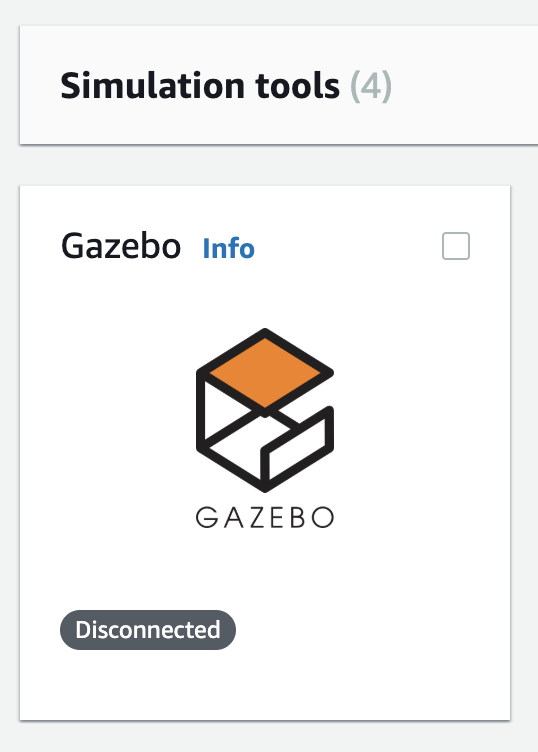
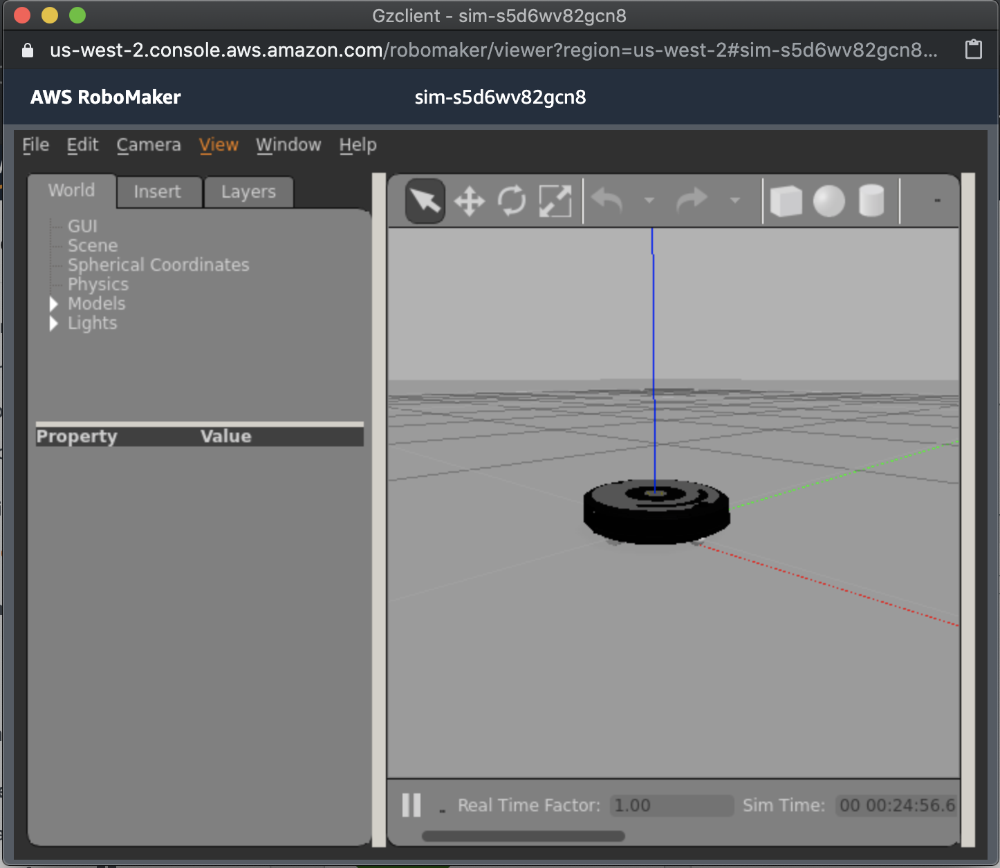

# Gazebo simulator

## Observation via the Gazebo simulator

The Gazebo application provides a view of your robot in the virtual world. If your simulation job is in a "Running" status, you're ready to interact with it!

Further down the Simulation jobs detail page, look for the Gazebo icon under "Simulation tools". Click the icon to launch Gazebo.



A window will open up, showing an empty virtual world with the robot sitting in the middle. 



### Send a test IoT Message

Remember when you used the IoT sent a test message to the `listener.py` file running in the AWS RoboMaker terminal? Let's send another message, and observe the Gazebo window to watch the robot move.

Back in your [AWS IoT console](https://us-west-2.console.aws.amazon.com/iot/home?region=us-west-2#/test), click "Test" from the left navigation menu. Scroll to the bottom of the right pane to the **Publish** section. As before, specify the topic as `voice_command`, and change  the payload to the following:

``` json
{
    "data": "spin"
}
```

Click the **Publish to topic** button, then cycle back to your Gazebo window, which has probably hidden itself behind your main browser window. If you see the robot spinning, you're nearly there! The robot rotates 360 degrees, one time. If it took you too long to find the window, you may have missed it. Rearrange your windows to make the observation process easier.

After you notice your robot spin, you're ready to [create an Alexa Skill to send voice commands](../ask/README.md).
