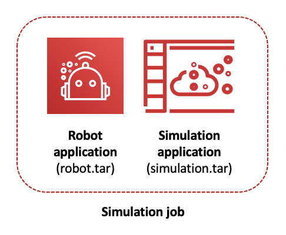
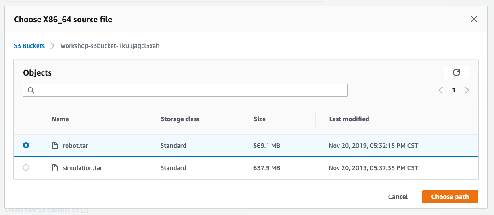
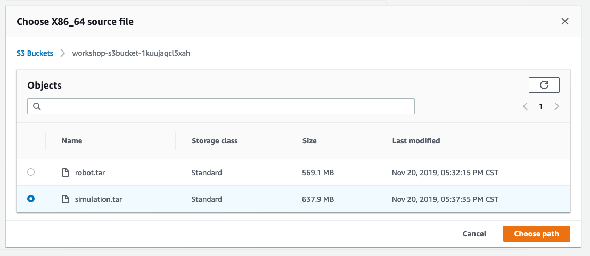
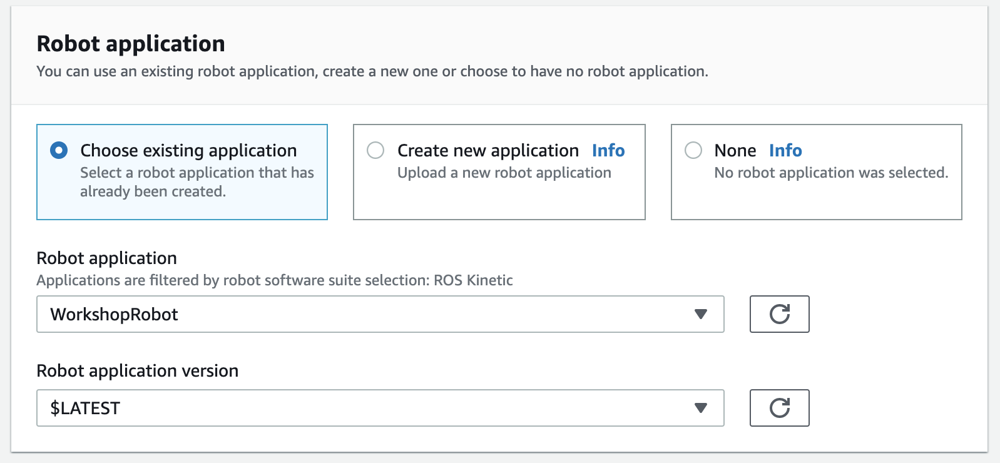
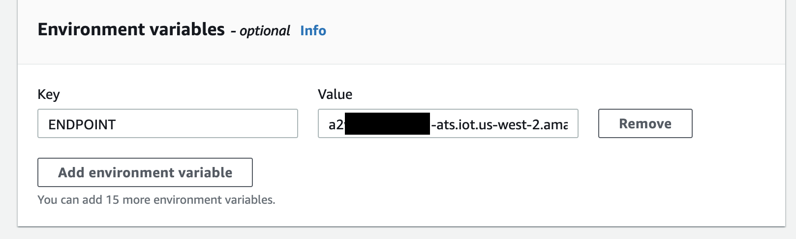

# Setting up your simulation

AWS RoboMaker allows us to simulate the robot operating inside a virtual world. This is an excellent way to test robotics before building and coding them in the real world. 

To do this, we'll create a **simulation job**. A simulation job is comprised of:

1) A _robot application_, which points to the robot.tar file you uploaded in the previous step.
2) A _simulation application_, which points to the simulation.tar file you uploaded in the previous step.

## Create a robot application

From the AWS RoboMaker dashboard, click the [Robot applications](https://us-west-2.console.aws.amazon.com/robomaker/home?region=us-west-2#robotApplications) menu item, then click the **Create robot application** button.

* Give your robot application the name "WorkshopRobot"
* Choose "ROS Kinetic" for the ROS distribution
* For "X86_64 source file", click the **Browse S3** button to navigate to your S3 folder and specify the `robot.tar` file you uploaded in the previous step. 
* Click the **Choose path** button.

Leave the "Tags" blank and then click the **Create** button.

## Create a simulation application

From the AWS RoboMaker dashboard, click the [Simulation applications](https://us-west-2.console.aws.amazon.com/robomaker/home?region=us-west-2#simulationApplications) menu item, then click the **Create simulation application** button.

* Give your simulation application the name "WorkshopSimulation"
* Choose "ROS Kinetic" for the ROS distribution
* Choose "Gazebo 7" for the simulation software suite
* Leave the simulation rendering engine at "OGRE 1.x"
* For "X86_64 source file", click the **Browse S3** button to navigate to your S3 folder and specify the `simulation.tar` file you uploaded in the previous step. 
* Click the **Choose path** button.

Leave the "Tags" blank and then click the **Create** button.

## Create a simulation job

From RoboMaker's left navigation menu, choose "Simulation jobs", then click the **Create simulation job** button.

* You'll want the job to run for the duration of this workshop, so you can configure the "Simulation job duration" for 2 hours. 
* Leave "Failure behavior" at "Fail"
* Choose "ROS Kinetic" for the "ROS distribution"
* For the "IAM Role", choose "VoiceRoboticsWorkshopExecutionRole", which was created by your CloudFormation script.
* Leave "Output destination" blank.
* For "Networking," choose the VPC labeled "VoiceRoboticsWorkshop"
* For "Security Groups," choose "default"
* For "Subnets," choose both subnets presented by the dropdown.
* Leave "Assign public IP" at "Yes"
* Leave "Enable connectivity to simulation" unchecked

Leave the "Tags" blank and then click the **Next** button.

### Specify robot application

We need to specify the robot application you created a moment ago. Make sure "Choose existing application" is selected, then choose "WorkshopRobot" with a version of "$LATEST".

* Set the "Launch package name" to "alexa"
* Set the "Launch file" to "voice_robot.launch"
* Under "Environment variables," add a "Key" of "ENDPOINT" and set your IoT Endpoint as the value. 

Click the **Next** button to continue.

### Specify simulation application

Like the robot application, we need to specify the simulation application you created a moment ago. Make sure "Choose existing application" is selected, then choose "WorkshopSimulation" with a version of "$LATEST".

* Set the "Launch package name" to "hello_world_simulation"
* Set the "Launch file" to "empty_world.launch"

Leave the environment variables blank, then click the **Next** button to continue.

### Launch the simulation job

Review the details for your simulation job and click the **Create** button. For reference you can compare your settings with the [Example Settings](../settings.md) provided.

Your simulation job will begin to build. Keep an eye on the "Status" section for details on the progress of the build. It might take up to 5 minutes for the simulation to start running.

### Status labels

Refer to the following labels for details on what each mean:

#### Status: Preparing

Hang tight! Your simulation is still being built.

#### Status: Running

When you see a status of "Running," you're ready to [interact with your robot!](gazebo.md)