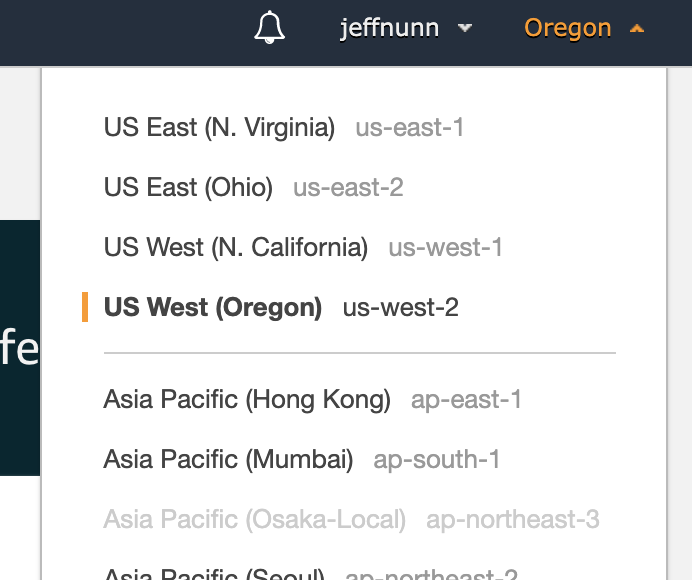
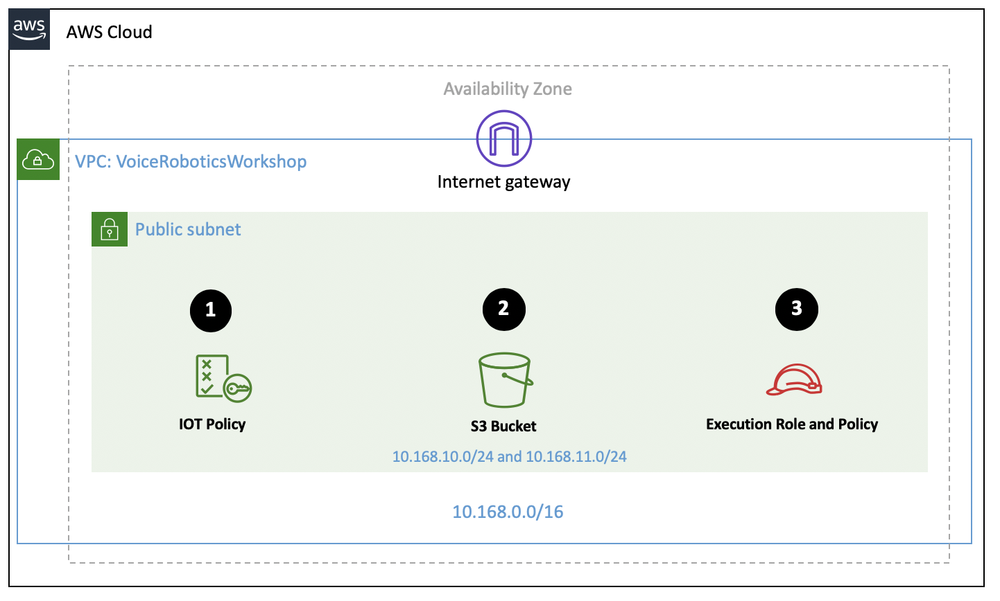
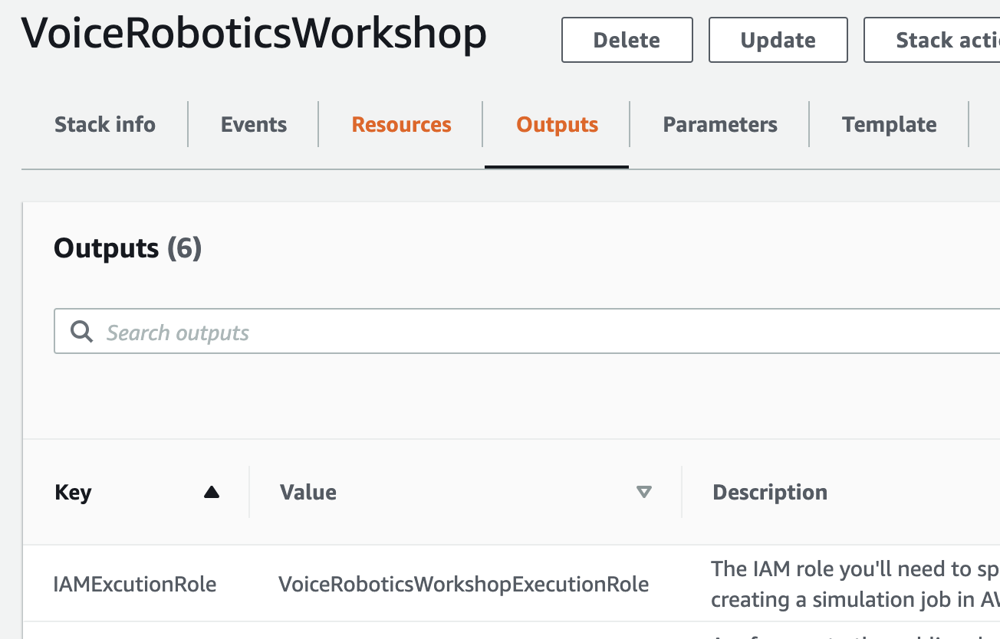

## Sign into the AWS console

To start, we need to sign into the AWS console. Amazon cloud computing resources are hosted in multiple locations worldwide. These locations are composed of AWS Regions and Availability Zones. In this workshop, make sure your region is set to **US West (Oregon)**. This region is also known as `us-west-2`.

## Set up your infrastructure with AWS CloudFormation

There are two primary components to the system you'll build today. The first component is a collection of AWS resources that process the commands you give your robot, and allow you to simulate the robot in a virtual environment. The second is part of the Alexa Skills Kit, and takes care of letting you interact with your robot via an Alexa-enabled device. 

The resources in the first component include a Virtual Private Cloud, IAM roles and security groups to control access, and an Amazon S3 bucket to store artifacts. 

To setup these resources, you will run a CloudFormation script to take care of the heavy lifting for you. The diagram below details the infrastructure that you'll launch:

### NOTE: Infrastructure
The script creates a Virtual Private Cloud (VPC) and two subnets to isolate your resources. It also creates 

1. an IoT policy communication to/from the IoT service for your robot. 
2. an S3 bucket that is used to store code for your robot and simulated world. 
3. an execution role and policy that allows your system to generate logs and to access resources in Amazon S3 for the simulation.

## AWS CloudFormation 

Let's launch those resources:

1. Open your [AWS CloudFormation console](https://us-west-2.console.aws.amazon.com/cloudformation/home?region=us-west-2#/stacks/create/template), and select "upload a template file". 
2. Click the "Choose File" button, then upload the `bootstrap.cfn.yaml` file you downloaded when you cloned this repo.

Step through the settings by clicking the **Next** button on each page, giving your stack the name "VoiceRoboticsWorkshop." Check the box for "I acknowledge that AWS CloudFormation might create IAM resources with custom names", then click the **Create Stack** button.

### NOTE: Be Patient
Wait for the CloudFormation script to complete before continuing. You should see a `CREATE_COMPLETE` status in your stack after a few minutes.

### TIP: Outputs
Pay close attention to the values provided in the "Outputs" tab:

You'll need these as you continue through the steps in this guide. It may help to keep this browser window open, or to copy and paste the values of the outputs to a text editor for use later.

## Creating a ROS Development Environment

AWS RoboMaker provides a quick and easy way to create an environment that is already configured for robot development. In just a few clicks, you can create a development environment and begin writing code.

### Steps

1. Visit the "Development Environments" [dashboard in AWS RoboMaker](https://us-west-2.console.aws.amazon.com/robomaker/home?region=us-west-2#ides).

2. Click the **Create environment** button.

3. Update your settings with the following values, then click the **Create** button.

| KEY                                   | VALUE(S)                                                                         |
|---------------------------------------|----------------------------------------------------------------------------------|
| Name                                  | WorkshopEnvironment                                                              |
| Pre-installed ROS distribution        | ROS Kinetic                                                                      |
| Instance type                         | m4.large                                                                         |
| IAM Role                              | _leave unchanged_                                                                |
| VPC                                   | _select the `VoiceRoboticsWorkshopVPC` which was created via CloudFormation_     |
| Subnets                               | _select either of the two subnets in the dropdown_                               |

### NOTE
The development environment can take up to five minutes to deploy. You can now continue on with this guide, we'll come back to your environment later. 

## Update your default security group

Next we need to open up a port in your security group so that you can test communications with your robot. 

1. Visit [Security Groups](https://us-west-2.console.aws.amazon.com/ec2/home?region=us-west-2#SecurityGroups:search=aws-cloud9-;sort=groupId) on the AWS EC2 dashboard. 
2. Select the security group that was created when your AWS RoboMaker environment launched. The "Group Name" will look something like `aws-cloud9-WorkshopEnvironment". 
3. Click the "Inbound" tab, which shows protocols, ports, and IP ranges for inbound traffic to your RoboMaker environment (RoboMaker gave SSH access by default). 
4. Click **Edit** to add one more rule, allowing TCP traffic on port 8883, then use the Source dropdown to choose "Anywhere" ("0.0.0.0/0").

| Type            | Protocol | Port Range | Source    | Description                  |
|-----------------|----------|------------|-----------|------------------------------|
| Custom TCP Rule | TCP      | 8883       | 0.0.0.0/0 | MQTT access from IoT console |

5. Click the **Save** button to save your changes.

When you've made this change, [you're ready for the next step!](../aws-iot/README.md)